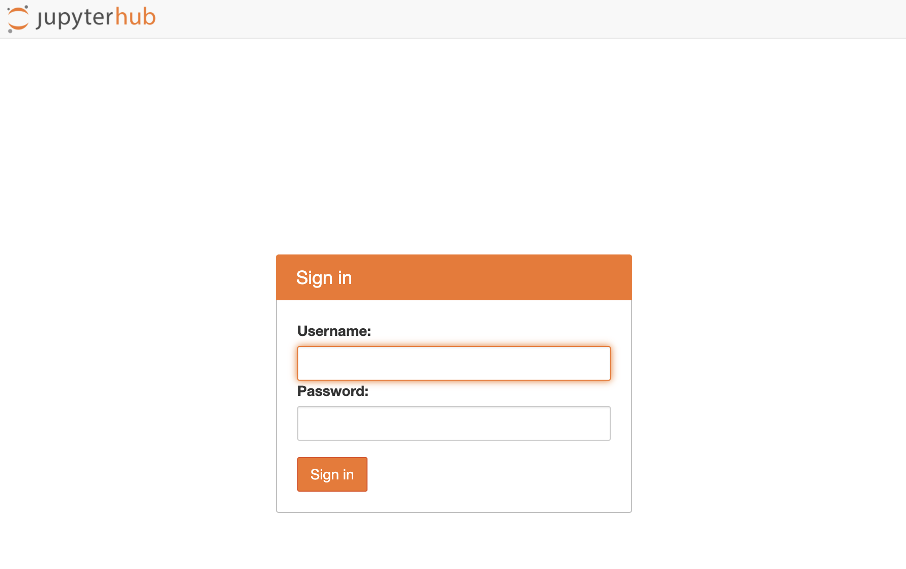

# 演習A

## 何をやるの？

- JupyterHub にアクセスします (A00-A01)
- R のノートブックを開きます (A02)
- Jupyterの基本動作を学びます（A03）
- JupyterでRを実行します（A04）
- ターミナルを開きます (A05)

## 実習用環境（Jupyter notebook）について

- Jupyter notebook はRを使うインターフェースの一つです。
- JupyterHubはたくさんのユーザに統一的なJupyter notebookの実行環境を提供するサーバーです。
- 受講者の皆さんは、JupyterHubにアクセスし、Jupyter notebookでRを使います。また、実習に使用するデータをダウンロードします。

## A00: 自分のユーザ名とパスワードを確認する

> **ユーザ名とパスワードはmanabaに記載してあります**  
> [manaba での限定公開情報](https://manaba.tsukuba.ac.jp/ct/page_2358336c1958448)

## A01: JupyterHub へアクセスする

> **URLはmanabaに記載してあります**  
> [manaba での限定公開情報](https://manaba.tsukuba.ac.jp/ct/page_2358336c1958448)

アクセスして下図のような画面が表示された場合、`ADVANCED`をクリックしてください（下図、矢印）。

- 

さらに、`Proceed to [IPアドレス] (unsafe)` をクリックします。

- 

すると、下図のようなログイン画面がでてきます。事前に配布したユーザ名とパスワードを入力して `Sign in` をクリックします。

- 

下図の画面が出たらログイン成功です。

- 

## A02: R のノートブックを開く

"New" のボタンをクリックします。

- 

"R" を選択します。

- 

新しいタブが開き、下図のように右上に "R"と書かれていたら成功です。


## A03: [Jupyter基本動作] ノートブックの名前を変更する

"Untitled" となっている部分をクリックすると、このノートブックのファイル名を変更できます。
ファイル名を "Training-A" と変更しましょう。

- 


## A04: [Jupyter基本動作] セルについて

四角で囲まれた場所をセルと呼びます。

セルにはコードを書き込むことができます。

- 


### A03: [Jupyter基本動作] セルを増やす

"+"のボタンを押した分だけセルが増えます。

- 

### A04: 実行してみる

Run を押すと、選択しているセルのコードが実行されます。

- 


## A05: ターミナルを実行する (1/2)

ターミナルを起動します。

`New`をクリックするとメニューが表示されます。

その中から`Terminal`をクリックします。

- 
- 

すると新しいタブでターミナル（黒い画面）が表示されます。

`ls` を実行すると、 `Pre-training.ipynb` が出力されるはずです。

```bash
$ ls
```

- 

