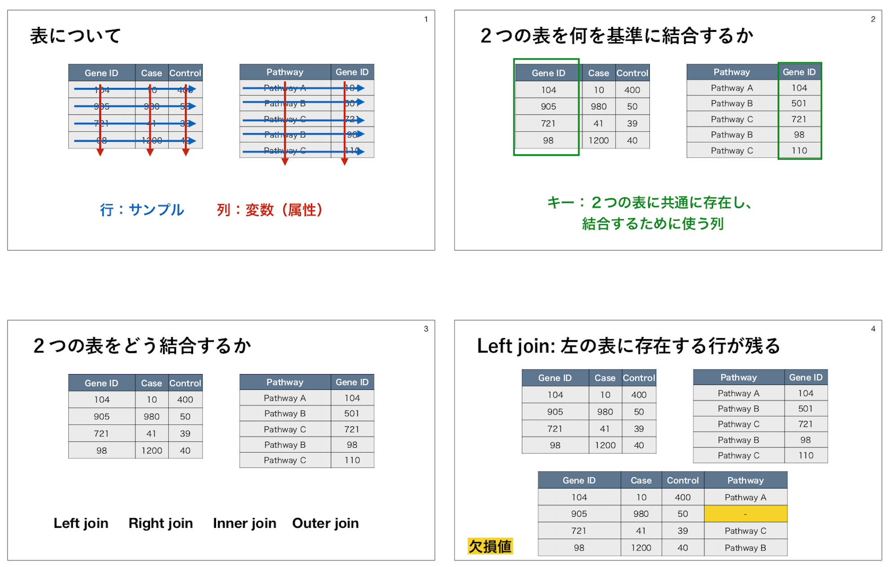
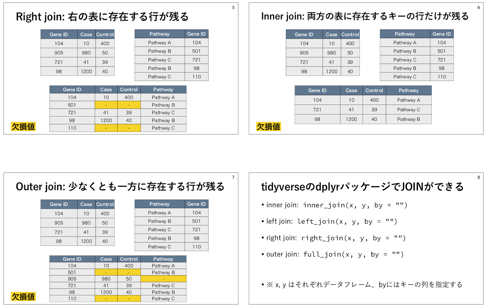

# 演習B

[トップページに戻る](../)

## 目次

- [演習B](#演習b)
  - [目次](#目次)
  - [1. データのダウンロード](#1-データのダウンロード)
  - [2. `tidyverse` について学ぶ](#2-tidyverse-について学ぶ)
    - [以降は R のノートブックを作成して始めましょう](#以降は-r-のノートブックを作成して始めましょう)
    - [`tidyverse` とは](#tidyverse-とは)
    - [tidyverse を使うには](#tidyverse-を使うには)
    - [テーブル（表）データの読み込み： `read_tsv()`, `read_csv()`](#テーブル表データの読み込み-read_tsv-read_csv)
  - [データテーブル（表）の形を調べるのに便利な関数： `dim()`, `head()`, `str()`](#データテーブル表の形を調べるのに便利な関数-dim-head-str)
    - [データフレームから特定の条件に当てはまる行を抽出する： `filter()`](#データフレームから特定の条件に当てはまる行を抽出する-filter)
    - [特定の列を抽出する： `select()`](#特定の列を抽出する-select)
    - [パイプ演算子 `%>%`](#パイプ演算子-)
    - [列を加える： `mutate()`](#列を加える-mutate)
    - [２つの列を結合する](#２つの列を結合する)
  - [3. `tumor_communication.ipynb` を実行する](#3-tumor_communicationipynb-を実行する)
    - [これはなんなのか？](#これはなんなのか)
    - [データの元論文](#データの元論文)
    - [サンプル・計測技術について](#サンプル計測技術について)
    - [解析の方針](#解析の方針)
    - [実行方法](#実行方法)
    - [使うデータの構造](#使うデータの構造)
- [演習 追記・QAなど](#演習-追記qaなど)
  - [4.テーブルの読み込みで、headを実行してTSVかCSVか確かめるとありますが、headを実行してもいろいろ文字が出てきてどこを見ればいいかわかりません…](#4テーブルの読み込みでheadを実行してtsvかcsvか確かめるとありますがheadを実行してもいろいろ文字が出てきてどこを見ればいいかわかりません)
  - [`!is.na()` の話](#isna-の話)
  - [`library(magrittr)`, `%<>%` の話](#librarymagrittr--の話)
  - [バックスラッシュ ( ` ) の話](#バックスラッシュ----の話)
  - [`%in%` について](#in-について)
  - [Rに組み込みの作図関数について](#rに組み込みの作図関数について)
    - [ヒストグラムを描く `hist()`](#ヒストグラムを描く-hist)
  - [プロットを描く `plot()`](#プロットを描く-plot)
    - [`filter()` でコンマ（`,`）で繋ぐのは](#filter-でコンマで繋ぐのは)
- [基本課題](#基本課題)
    - [基本課題B-1](#基本課題b-1)
    - [基本課題B-2](#基本課題b-2)
    - [基本課題B-3](#基本課題b-3)
    - [基本課題A-4](#基本課題a-4)
    - [基本課題A-5](#基本課題a-5)

## 1. データのダウンロード

Jupyter Hubのターミナルを開き、以下のコマンドを実行してデータをダウンロードしてください。

```bash
mkdir data

cd data

wget https://raw.githubusercontent.com/bioinfo-tsukuba/20201226-EB62104-bioinformatics-course/master/tutorial/data/GSE59831_processed_data_FPKM.txt

wget https://github.com/bioinfo-tsukuba/20201226-EB62104-bioinformatics-course/raw/master/tutorial/data/CCCExplorer/CD11CB_output/gene_exp.diff

wget https://github.com/bioinfo-tsukuba/20201226-EB62104-bioinformatics-course/raw/master/tutorial/data/CCCExplorer/HOM_MouseHumanSequence.rpt

wget https://github.com/bioinfo-tsukuba/20201226-EB62104-bioinformatics-course/raw/master/tutorial/data/CCCExplorer/EP_output/genes.read_group_tracking

wget https://github.com/bioinfo-tsukuba/20201226-EB62104-bioinformatics-course/raw/master/tutorial/data/CCCExplorer/LR_manual_revised.txt

cd ../
```

## 2. `tidyverse` について学ぶ

### 以降は R のノートブックを作成して始めましょう

- R のノートブックを新しく作成してください
- タイトルを "training_B" に変更してください

### `tidyverse` とは

- データサイエンスに便利なパッケージの集合体
- 今日の授業で毎回使用します

### tidyverse を使うには

そのノートブックの中で一度、以下を実行する必要があります。

```R
library(tidyverse)
```

以下のような(感じの）メッセージが出てくると思います（問題ありません）


    ── Attaching packages ─────────────────────────────────────── tidyverse 1.3.0 ──
    
    ✔ ggplot2 3.3.3     ✔ purrr   0.3.4
    ✔ tibble  3.0.5     ✔ dplyr   1.0.3
    ✔ tidyr   1.1.2     ✔ stringr 1.4.0
    ✔ readr   1.4.0     ✔ forcats 0.5.1
    
    ── Conflicts ────────────────────────────────────────── tidyverse_conflicts() ──
    ✖ dplyr::filter() masks stats::filter()
    ✖ dplyr::lag()    masks stats::lag()


### テーブル（表）データの読み込み： `read_tsv()`, `read_csv()`

- データの読み込みには `read_tsv()`, `read_csv()` を用います
- TSV はタブ区切りファイル、CSV はコンマ区切りファイルのことです
  - 1\.でダウンロードしたファイルがTSVかCSVかは、ターミナルで `head` コマンドで確かめられます
- 例えば、 `GSE59831_processed_data_FPKM.txt` はタブ区切りファイルなので、 `read_tsv()` で読み込むことができます
  - `col_names=TRUE` は、１行目を列名として扱ってほしいという意味です。

以下のコマンドは、 `GSE59831_processed_data_FPKM.txt` を読み込み、 `df1` というオブジェクトに格納することを表します。

```R
df1 <- read_tsv("data/GSE59831_processed_data_FPKM.txt", col_names=TRUE)
```


## データテーブル（表）の形を調べるのに便利な関数： `dim()`, `head()`, `str()`

- `head()` はデータフレームの最初の6行を表示します
- `dim()` はデータフレームの行数と列数を出力します
- `str()` は行数と列数のほか、データフレームがどんな列（列名、列のデータ型）を持つかを表示します
- `nrow()`、`ncol()` はそれぞれ行数、列数を出力します

以下に実行例を示します。

```R
head(df1)
```

こんな結果が返ってきます：

<table class="dataframe">
<caption>A tibble: 6 × 29</caption>
<thead>
	<tr><th scope=col>mice_gene_symbol</th><th scope=col>human_gene_symbol</th><th scope=col>Tum1</th><th scope=col>Tum2</th><th scope=col>Tum3</th><th scope=col>WT1</th><th scope=col>WT2</th><th scope=col>Tum4</th><th scope=col>Tum5</th><th scope=col>WT3</th><th scope=col>⋯</th><th scope=col>Tum11</th><th scope=col>WT8</th><th scope=col>WT9</th><th scope=col>WT10</th><th scope=col>Tum12</th><th scope=col>Tum13</th><th scope=col>Tum14</th><th scope=col>WT11</th><th scope=col>WT12</th><th scope=col>WT13</th></tr>
	<tr><th scope=col>&lt;chr&gt;</th><th scope=col>&lt;chr&gt;</th><th scope=col>&lt;dbl&gt;</th><th scope=col>&lt;dbl&gt;</th><th scope=col>&lt;dbl&gt;</th><th scope=col>&lt;dbl&gt;</th><th scope=col>&lt;dbl&gt;</th><th scope=col>&lt;dbl&gt;</th><th scope=col>&lt;dbl&gt;</th><th scope=col>&lt;dbl&gt;</th><th scope=col>⋯</th><th scope=col>&lt;dbl&gt;</th><th scope=col>&lt;dbl&gt;</th><th scope=col>&lt;dbl&gt;</th><th scope=col>&lt;dbl&gt;</th><th scope=col>&lt;dbl&gt;</th><th scope=col>&lt;dbl&gt;</th><th scope=col>&lt;dbl&gt;</th><th scope=col>&lt;dbl&gt;</th><th scope=col>&lt;dbl&gt;</th><th scope=col>&lt;dbl&gt;</th></tr>
</thead>
<tbody>
	<tr><td>0610007P14Rik</td><td>C14orf1 </td><td> 9.31368</td><td>10.13680</td><td>12.26660</td><td>11.92950</td><td>11.34170</td><td>10.45680</td><td>10.44590</td><td>13.05840</td><td>⋯</td><td>21.99580</td><td>33.98430</td><td>23.50140</td><td>24.80460</td><td>17.16570</td><td>12.51170</td><td>16.03630</td><td>14.69160</td><td>14.03290</td><td>14.20440</td></tr>
	<tr><td>0610009D07Rik</td><td>SF3B14  </td><td>25.35280</td><td>32.25990</td><td>26.61000</td><td>29.73440</td><td>37.16520</td><td>37.57330</td><td>30.74340</td><td>32.30680</td><td>⋯</td><td>28.76030</td><td>21.51540</td><td>30.83840</td><td>19.26180</td><td>35.14690</td><td>33.53620</td><td>42.73760</td><td>29.27860</td><td>29.37960</td><td>28.06600</td></tr>
	<tr><td>0610009O20Rik</td><td>KIAA0141</td><td>12.45760</td><td>10.17690</td><td>11.95220</td><td>10.62740</td><td> 7.04763</td><td> 9.63765</td><td>11.11900</td><td>13.35890</td><td>⋯</td><td>20.57930</td><td>18.12230</td><td>18.65090</td><td>18.58170</td><td>15.60410</td><td>15.34920</td><td>13.04400</td><td>16.76130</td><td>15.91300</td><td>18.05510</td></tr>
	<tr><td>0610010F05Rik</td><td>KIAA1841</td><td> 5.84091</td><td> 6.54488</td><td> 6.65366</td><td> 4.80074</td><td> 6.06263</td><td> 5.57042</td><td> 5.21223</td><td> 5.56449</td><td>⋯</td><td> 8.04684</td><td> 5.92199</td><td> 6.23551</td><td> 4.73364</td><td> 5.98708</td><td> 4.26902</td><td> 4.16373</td><td> 3.47511</td><td> 3.71875</td><td> 3.95344</td></tr>
	<tr><td>0610010K14Rik</td><td>C17orf49</td><td>25.63690</td><td>24.08560</td><td>20.17560</td><td>25.34280</td><td>29.14040</td><td>31.46110</td><td>28.30990</td><td>22.17650</td><td>⋯</td><td>18.00200</td><td>24.00260</td><td>21.85860</td><td>23.72630</td><td>28.46520</td><td>31.19330</td><td>26.40880</td><td>32.53430</td><td>26.93620</td><td>29.38080</td></tr>
	<tr><td>0610011F06Rik</td><td>C16orf13</td><td> 3.48174</td><td> 5.79169</td><td> 3.73809</td><td> 5.94575</td><td> 5.98899</td><td> 9.04125</td><td> 5.84235</td><td> 7.36357</td><td>⋯</td><td>42.61460</td><td>38.91730</td><td>33.56900</td><td>37.34490</td><td>20.33750</td><td>18.81900</td><td>14.17990</td><td>14.93870</td><td>16.12340</td><td>13.39220</td></tr>
</tbody>
</table>


今度はこれを実行してみましょう：

```R
dim(df1)
```

こんな結果が返ってきます（行数、列数）：

    16024   29

今度はこれを実行してみましょう：

```R
str(df1)
```

[16,024 × 29] は行数と列数を表します。また、 `$` で始まる行は、各列にどのような値が格納されているかを表します：

    tibble [16,024 × 29] (S3: spec_tbl_df/tbl_df/tbl/data.frame)
     $ mice_gene_symbol : chr [1:16024] "0610007P14Rik" "0610009D07Rik" "0610009O20Rik" "0610010F05Rik" ...
     $ human_gene_symbol: chr [1:16024] "C14orf1" "SF3B14" "KIAA0141" "KIAA1841" ...
     $ Tum1             : num [1:16024] 9.31 25.35 12.46 5.84 25.64 ...
     $ Tum2             : num [1:16024] 10.14 32.26 10.18 6.54 24.09 ...
     $ Tum3             : num [1:16024] 12.27 26.61 11.95 6.65 20.18 ...
     $ WT1              : num [1:16024] 11.9 29.7 10.6 4.8 25.3 ...
     $ WT2              : num [1:16024] 11.34 37.17 7.05 6.06 29.14 ...
     $ Tum4             : num [1:16024] 10.46 37.57 9.64 5.57 31.46 ...
     $ Tum5             : num [1:16024] 10.45 30.74 11.12 5.21 28.31 ...
     $ WT3              : num [1:16024] 13.06 32.31 13.36 5.56 22.18 ...
     $ WT4              : num [1:16024] 8.74 25.08 12.65 3.93 28.72 ...
     $ Tum6             : num [1:16024] 3.9 31.15 3.93 1.56 22.08 ...
     $ Tum7             : num [1:16024] 2.54 33.48 3.74 1.68 19.04 ...
     $ Tum8             : num [1:16024] 3.34 36.3 3.67 1.24 18.23 ...
     $ WT5              : num [1:16024] 1.14 26.84 2.88 1.05 6.45 ...
     $ WT6              : num [1:16024] 1.553 24.426 3.984 0.645 11.169 ...
     $ WT7              : num [1:16024] 2.7 22.99 3.74 1.1 8.6 ...
     $ Tum9             : num [1:16024] 21.51 30.39 19.15 7.35 20.08 ...
     $ Tum10            : num [1:16024] 25.08 23.83 20.82 7.22 22.06 ...
     $ Tum11            : num [1:16024] 22 28.76 20.58 8.05 18 ...
     $ WT8              : num [1:16024] 33.98 21.52 18.12 5.92 24 ...
     $ WT9              : num [1:16024] 23.5 30.84 18.65 6.24 21.86 ...
     $ WT10             : num [1:16024] 24.8 19.26 18.58 4.73 23.73 ...
     $ Tum12            : num [1:16024] 17.17 35.15 15.6 5.99 28.47 ...
     $ Tum13            : num [1:16024] 12.51 33.54 15.35 4.27 31.19 ...
     $ Tum14            : num [1:16024] 16.04 42.74 13.04 4.16 26.41 ...
     $ WT11             : num [1:16024] 14.69 29.28 16.76 3.48 32.53 ...
     $ WT12             : num [1:16024] 14.03 29.38 15.91 3.72 26.94 ...
     $ WT13             : num [1:16024] 14.2 28.07 18.06 3.95 29.38 ...
     - attr(*, "spec")=
      .. cols(
      ..   mice_gene_symbol = col_character(),
      ..   human_gene_symbol = col_character(),
      ..   Tum1 = col_double(),
      ..   Tum2 = col_double(),
      ..   Tum3 = col_double(),
      ..   WT1 = col_double(),
      ..   WT2 = col_double(),
      ..   Tum4 = col_double(),
      ..   Tum5 = col_double(),
      ..   WT3 = col_double(),
      ..   WT4 = col_double(),
      ..   Tum6 = col_double(),
      ..   Tum7 = col_double(),
      ..   Tum8 = col_double(),
      ..   WT5 = col_double(),
      ..   WT6 = col_double(),
      ..   WT7 = col_double(),
      ..   Tum9 = col_double(),
      ..   Tum10 = col_double(),
      ..   Tum11 = col_double(),
      ..   WT8 = col_double(),
      ..   WT9 = col_double(),
      ..   WT10 = col_double(),
      ..   Tum12 = col_double(),
      ..   Tum13 = col_double(),
      ..   Tum14 = col_double(),
      ..   WT11 = col_double(),
      ..   WT12 = col_double(),
      ..   WT13 = col_double()
      .. )

### データフレームから特定の条件に当てはまる行を抽出する： `filter()`

- `filter()` は第１引数にデータフレーム、第２引数に条件式を書くと、条件に当てはまる行を抽出する

以下に例を示します

```R
# Tum1 列の値が100より大きい行を抽出
filter(df1, Tum1 > 100)

# Tum1 列の値が100より大きく、WT1 列の値が10より小さい行を抽出
# (& は同時に満たすべき条件を組み合わせる)
filter(df1, Tum1 > 100 & WT1 <10)

# Tum1 列の値が100より大きいか、Tum1 列の値が100より大きい行を抽出
# (| はいずれか満たすべき条件を組み合わせる)
filter(df1, Tum1 > 100 | Tum2 > 100)

# 「Tum1 列の値が100より大きいか、Tum1 列の値が100より大きい」
# かつ「WT1列の値が10より小さいか、WT2列の値が10より小さい」行を抽出
# (カッコで囲むことでひとまとまりとして扱える)
filter(df1, (Tum1>100 | Tum2>100) & (WT1<10 | WT2<10) ) 
```

なお、抽出された結果は、元のデータフレーム自体には保存されないため、別のオブジェクトに格納する必要がある

```R
df1_sub <- filter(df1, Tum1 > 100)

# 上と同じ意味
filter(df1, Tum1 > 100) -> df1_sub
```

### 特定の列を抽出する： `select()`

- `select()` は第１引数にデータフレーム、第２（以降）引数に列名を書くと、条件に当てはまる列を抽出する
  - 列名にスペースが入っている場合はバックスラッシュ（ ` ）で囲む必要がある

以下に例を示す

```R
# mice_gene_symbol 列を抽出する
select(df1, mice_gene_symbol)

# mice_gene_symbol 列とWT1列を抽出する
select(df1, mice_gene_symbol, WT1)

# mice_gene_symbol 列を抽出する
select(df1, mice_gene_symbol, human_gene_symbol, WT1)

# mice_gene_symbol 列以外を抽出する
# (-を前につけるとその列を除く)
select(df1, -mice_gene_symbol)
```

なお、抽出された結果は、元のデータフレーム自体には保存されないため、別のオブジェクトに格納する必要がある

```R
df1_selected <- select(df1, mice_gene_symbol, WT1)

# 上と同じ意味
select(df1, mice_gene_symbol, WT1) -> df1_selected
```

### パイプ演算子 `%>%`

- `%>%` → これのこと
- `tidyverse` パッケージで使用できる

以下に例を示す

```R
# str(df1) と同じ
df1 %>% str
```

```R
# select(df1, mice_gene_symbol, WT1) と同じ
df1 %>% select(mice_gene_symbol, WT1)

# %>% の後に改行やインデントが入っても同じ意味
df1 %>% 
    select(mice_gene_symbol, WT1)
```

```R
# select(filter(df1, Tum1>100), WT) と同じ意味
# (パイプをつなげることもできる)
df1 %>% 
    filter(Tum1>100) %>%
    select(mice_gene_symbol, WT1)

# 結果を格納することもできる
df1 %>% 
    filter(Tum1>100) %>%
    select(mice_gene_symbol, WT1) -> df1_filtered_selected
```

### 列を加える： `mutate()`

- `mutate()` は新しい列を加えることができる
  - 第２引数では、`=` の前に新しい列名を書き、`=` の後に条件を書く

```R
mutate(df1, Tum123_mean = (Tum1+Tum2+Tum3)/3)

# 上と同じ
df1 %>% mutate(Tum123_mean = (Tum1+Tum2+Tum3)/3)
```

```R
# 同時に複数も可能
mutate(df1, Tum123_mean = (Tum1+Tum2+Tum3)/3, WT12_mean = (WT1+WT2)/2)

# 上と同じ
df1 %>% mutate(Tum123_mean = (Tum1+Tum2+Tum3)/3, WT12_mean = (WT1+WT2)/2)
```

### ２つの列を結合する

- ２つの列を結合する操作を一般に JOIN (じょいん)と呼ぶ
- ２つの表を結合するための列をキー（key）と呼ぶ





```R
df2 <- read_tsv("data/HOM_MouseHumanSequence.rpt", col_names=TRUE)

# (キーの名前が２つの表で違う時は以下のように書くとよい)
inner_join(df1, df2, by = c("mice_gene_symbol"="Symbol"))

# 上と同じ
df1 %>% 
    inner_join(df2, by = c("mice_gene_symbol"="Symbol"))

# join の結果を新たなオブジェクトに格納する
df1 %>% 
    inner_join(df2, by = c("mice_gene_symbol"="Symbol")) -> df1_and_2
```

## 3. `tumor_communication.ipynb` を実行する

### これはなんなのか？

- 「非小細胞肺癌 (non-small-cell lung cancer; NSCLC)において、腫瘍組織内に存在する間質細胞から腫瘍細胞にシグナルのクロストークが起こって腫瘍が活性化されるか？ 」を調べてみる解析をRで行うノートブック
  - `.ipynb` というのがノートブックの拡張子です

### データの元論文

- Toi et al., Transcriptome Analysis of Individual Stromal Cell Populations Identifies Stroma-Tumor Crosstalk in Mouse Lung Cancer Model, Cell Reports (2015)
- https://doi.org/10.1016/j.celrep.2015.01.040


### サンプル・計測技術について
- 腫瘍モデルマウス由来のRNA-seqデータ
- ５種類の組織・細胞群 x 2種類の条件：
  - ５種類の組織・細胞群細胞群：
    - NSCLCモデルマウスと野生型のマウスの肺からセルソーターで分けたもの：マクロファージ、単球細胞、好中球、上皮細胞
      - 細胞型の分類は細胞表面の抗原マーカーによる
        - 
    - Total lung cells
  - 2種類の条件: WT （野生型; Wild type)、Tum (腫瘍; Tumor)

### 解析の方針

- 間質細胞において「正常組織由来のサンプル」に比べて「腫瘍組織由来のサンプル」で発現量が増加している遺伝子群を抽出する
- 腫瘍組織において正常組織において発現量が増加している遺伝子群を抽出する
- 「1.に含まれるリガンド」と「2.に含まれる受容体（レセプター）」をリガンド・受容体のペアのデータベースと比較する

### 実行方法

まず、Jupyter Hub のターミナルで以下のコマンドを実行してください。

```bash
wget https://www.dropbox.com/s/47qm8i5na8rket0/tumor_communication.ipynb
```

次に、Juputer Hub で `tumor_communication.ipynb` を開く。

### 使うデータの構造

- `gene_exp.diff`
  - マクロファージにおいて、各遺伝子の発現にWTとTumの条件間で差があるかを調べる発現変動解析の結果
  - 列の説明
    - test_id: 略
    - gene_id: 遺伝子ID（ここでは遺伝子名が用いられている）
    - gene: 略
    - locus: 略
    - sample_1: 略
    - sample_2: 略
    - status: 略
    - value_1: 正常組織でのマクロファージにおける遺伝子発現量の平均値
    - value_2: 腫瘍組織内マクロファージ (intratumoral macropahges)での遺伝子発現量の平均値
    - log2(fold_change): value_2/value_1をlog2変換したもの。正の値であれば value_2 > value_1、負の値であれば value_1 > value_2
    - test_stat: 略
    - p_value: 発現変動を判定する統計検定の結果のp-value。小さい方が統計的に有意。
    - q_value: p_value を多重検定補正したもの。小さい方が統計的に有意。
    - significant: 略

> ※ 縦に遺伝子名のようなものが並んでいる。各行が遺伝子、各列が変数になっている
p_valueやq_valueは発現変動を判定する統計検定の結果だろう
log2(fold_change) は value_2/value_1をlog2変換したものだろう
ちなみに、value_1 は正常組織でのマクロファージ、 value_2 は腫瘍組織内マクロファージ (intratumoral macropahges)でのFPKMの平均値
これは メタデータ をみないとわからない

- `HOM_MouseHumanSequence.rpt`
  - ヒト-マウスのオーソログ関係の表。生物種ごとの遺伝子について記述されている。
  - 列の説明
    - HomoloGene ID: オーソログ関係自体のID。これが互いに共通なヒト遺伝子・マウス遺伝子はオーソログ関係にある
    - Common Organism Name: 生物種名
    - NCBI Taxon ID: 略
    - Symbol: 遺伝子シンボル
    - EntrezGene ID
    - Mouse MGI ID: 略
    - HGNC ID: 略
    - OMIM Gene ID: 略
    - Genetic Location: 略
    - Genomic Coordinates (mouse: GRCm38, human: GRCh37.p10): 略
    - Nucleotide RefSeq IDs: 略
    - Protein RefSeq IDs: 略
    - SWISS_PROT IDs: 略

- `genes.read_group_tracking`
  - 腫瘍細胞において各遺伝子の発現量をまとめた表
  - 列の説明
    - tracking_id: 遺伝子のID
    - condition: 略
    - replicate: 略
    - raw_frags: 略
    - internal_scaled_frags: 略
    - external_scaled_frags: 略
    - FPKM: 正規化された遺伝子発現量。大きい方が遺伝子発現量（mRNA量）が多い。
    - effective_length: 略
    - status: 略

- `LR_manual_revised.txt`
  - ヒトにおける、リガンドと受容体のペアの対応関係をまとめた表
  - 列の説明
    - From: リガンドの遺伝子シンボル
    - To: 受容体の遺伝子シンボル  


- `GSE59831_processed_data_FPKM.txt`
  - 各サンプルでの各遺伝子の発現量を調べた表
    - Tum1, Tum2, Tum3 が腫瘍組織内マクロファージ、WT1, WT2が野生型組織でのマクロファージ、Tum9, Tum10, Tum11が腫瘍細胞における遺伝子発現量
  - 列の説明
    - mice_gene_symbol: マウスのおける遺伝子シンボル
    - human_gene_symbol: ヒトのおける遺伝子シンボル
    - Tum1
    - Tum2
    - Tum3
    - WT1
    - WT2
    - Tum4
    - Tum5
    - WT3
    - WT4
    - Tum6
    - Tum7
    - Tum8
    - WT5
    - WT6
    - WT7
    - Tum9
    - Tum10
    - Tum11
    - WT8
    - WT9
    - WT10
    - Tum12
    - Tum13
    - Tum14
    - WT11
    - WT12
    - WT13


----
----
----
----

# 演習 追記・QAなど

<!-- ## `.ipynb`ファイルのダウンロード・アップロードする方法
1. GitHub の tumor_communication.ipynb のページまで行きます
	- https://github.com/bioinfo-tsukuba/20210207-EB62104-Bioinformatics/blob/main/%E6%BC%94%E7%BF%92A/tumor_communication.ipynb
2. Raw というボタンを押すと、ファイルの中身が直接ブラウザに表示されます
	- URL例: https://raw.githubusercontent.com/bioinfo-tsukuba/20210207-EB62104-Bioinformatics/main/%E6%BC%94%E7%BF%92A/tumor_communication.ipynb
3. ２通りの方法があります
	- a: 一旦ファイルを自分のコンピューターに保存して、JupyterHubにアップロード
	- b: jupyterHubのターミナルで wget で URL から直接ダウンロード -->


<!-- ### 基本課題A-3 ですが、 outer_join と書いてあるのは full_join の誤りでした

・関数名は `full_join()` でした
・manaba で修正しました https://manaba.tsukuba.ac.jp/ct/course_1318532_rptadmpreview_1855392
・GitHub でも修正しました https://github.com/bioinfo-tsukuba/20210207-EB62104-Bioinformatics/tree/main/%E6%BC%94%E7%BF%92A -->

<!-- ### 基本課題 A-3 は行数のみを提出してください

基本課題 A-3 は行数のみを提出してください（コードは提出しません） -->
<!-- 
### 基本課題A-5 の提出方法を変更します (PDFではなくHTML)

- PDF としていましたが、 HTML (.html) でダウンロードし、manabaで提出してください
- PDF出力がノートブック大きい場合にエラーに出るための措置です -->


## 4.テーブルの読み込みで、headを実行してTSVかCSVか確かめるとありますが、headを実行してもいろいろ文字が出てきてどこを見ればいいかわかりません…

簡易的には、

- コンマで区切られていなければ CSV ではない
- 一方で、半角スペースではなくタブっぽい間の空き方だったら、TSV

あとは例えば、 `awk` というコマンドを使う方が確実かもしれません

```bash
# １行目にタブが含まれていたら１行目が出力される → TSV
$ awk 'NR==1 && /\t/{print}' data/GSE59831_processed_data_FPKM.txt

# １行目にコンマが含まれていたら１行目が出力される → CSV
$awk 'NR==1 && /,/{print}' data/GSE59831_processed_data_FPKM.txt
```

## `!is.na()` の話

- JOIN で NA などの欠損値が出ることがあります
- 欠損値が邪魔な場合に除くには、まずどれが欠損値かを調べる必要があります
- `is.na()` は欠損値であれば TRUE、そうでなければ FALSEを返します
- `!` がつくと TRUE/FALSE を逆転させます。
  - `! (WT1>100)` は `(WT1<=100)` と同じ意味です
- なので、 `!is.na(列名)` は ある列の値が欠損値 （NA） **でない** 行ならばTRUE、 NAならばFALSEを返します

```R
# human が NA でないの行だけにする
fpkm_epi_tumor_human %<>% filter(!is.na(human))

# human が NA でないの行だけにする (上と同じ意味)
fpkm_epi_tumor_human %<>% filter(! is.na(human))
```

## `library(magrittr)`, `%<>%` の話

- `magrittr` パッケージが使える
- 例えば `%<>%` が使える。これはパイプの結果を戻して代入すること

```R
df1_selected <- select(df1, mice_gene_symbol, WT1)

# 以下の３つは同じ意味
df1_selected %<>% fitler(WT1 > 100)

df1_selected %<>% 
    fitler(WT1 > 100)

df1_selected %>%
    fitler(WT1 > 100) -> df1_selected
```

## バックスラッシュ ( ` ) の話

・Rでは文字列を " (ダブルクオート） もしくは ' （シングルクオート）で囲みます
・一方、tidyverse では列名を " や ' で囲まずに、そのまま書きます
・ところが、列名に半角スペースやカッコが含まれているとうまくいかない。その場合ににはバッククオート（`）で列名を囲むと「そのままの列名」としてRに解釈してもらえる

```R
# この例では  log2(fold_change)  をバッククオートで囲んでいる
deg_macrophage %<>% select(gene_id, value_1, value_2, `log2(fold_change)`, p_value, q_value)

# 注意：バッククオートを外すとうまくいかなくなる
deg_macrophage %<>% select(gene_id, value_1, value_2, log2(fold_change), p_value, q_value)
```

## `%in%` について

- `%in%` は、あるベクトルの要素が別のベクトルの要素に含まれているかを返す演算子です
- `a %in% b` で、aとbがそれぞれベクトルの時、aの各要素が b に含まれるかどうかを（aの長さの分だけ） TRUEもしくはFALSEで返します

```R
a <- c("A", "W", "Z") 

b <- c("A", "B", "C", "X", "Y", "Z")

# a の "A", "Z" は b に含まれるが、"W" は含まれないので、
# 順に TRUE FALSE TRUE が出力される
a %in% b
```

```R
# `From %in% deg_macrophage_tumor_human$human` は
# From の各要素が deg_macrophage_tumor_human$human に含まれるなら TRUE、 
# そうでないなら FALSE を返す
dflr %>% 
    mutate(ligand_up_in_tumor_macrophage = From %in% deg_macrophage_tumor_human$human) 
```


## Rに組み込みの作図関数について

### ヒストグラムを描く `hist()`

- `hist()` は第一引数で数値の列を与えると、そのヒストグラムを描きます

## プロットを描く `plot()`

- `plot()` は様々なプロットを描ける関数です
- 例えば、 `plot(x, y)` と x と y が同じ長さの数値列の場合、散布図を描くことができます

### `filter()` でコンマ（`,`）で繋ぐのは

```R
# 以下の２つは同じ意味です
s
filter(`log2(fold_change)` > log2(1.5), q_value < 0.1) 
```

----
----
----
----
----


# 基本課題

### 基本課題B-1

- 以下のようなRのコードを作成しなさい
  - `tidyverse` を使う
  - `HOM_MouseHumanSequence.rpt` を読み込んで、 `df_hom` というRオブジェクトに格納する
  - 行数と列数を調べる
- 上のメニューから `File > Download as > R (.r)` とすることで、Rのコードをダウンロードできるので、それを manaba で提出せよ

### 基本課題B-2

- 以下のようなコードを作成しなさい
  - `dim(df1)` をパイプ演算子を使った表現に書き換える
- manaba に直接書き込め (ファイル提出ではない)

### 基本課題B-3

- df1 と df2 を `inner_join()`, `left_join()`, `right_join()`, `full_join()` でJOINした際に、それぞれの結果の行数を調べよ
  - ただし、キーは `c("human_gene_symbol"="Symbol")` として設定する
- manaba に直接書き込め (ファイル提出ではない)
  - 半角で４種類の行数をコンマ（`,`）で区切れ（例： `103,130,142,210`）

### 基本課題A-4

- `LR_manual_revised.txt` を読み込み、 `From`列と`To`列にそれぞれユニークな要素がいくつあるかを調べるRのコードを作成し、実行せよ
  - ヒント：unique() を使うと、重複のある行を除くことができる
- 新しいノートブックを作成して作成すること
- 上のメニューから `File > Download as > Notebook (.ipynb)` とすることで、Rのコードをダウンロードできるので、それを manaba で提出せよ

### 基本課題A-5

- [tumor_communication.ipynb](tumor_communication.ipynb) をダウンロードし、実行せよ
- 上のメニューから `File > Download as > HTML (.html)` とすることで、実行結果をダウンロードできるので、それを manaba で提出せよ
